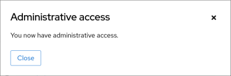

# Workshop Exercise - Review Pre-conversion Reports

## Table of Contents

- [Workshop Exercise - Review Pre-conversion Reports](#workshop-exercise---review-pre-conversion-reports)
  - [Table of Contents](#table-of-contents)
  - [Objectives](#objectives)
  - [Guide](#guide)
    - [Step 1 - Managing Convert2RHEL Pre-conversion Results](#step-1---managing-convert2rhel-pre-conversion-results)
    - [Step 2 - Navigating the CentOS Web Console](#step-2---navigating-the-rhel-web-console)
    - [Step 3 - Review Convert2RHEL Pre-conversion Report of CentOS 7 Host](#step-3---review-convert2rhel-pre-conversion-report-of-centos-7-host)
    - [Challenge Lab: What About Ignoring So Many High Findings?](#challenge-lab-what-about-ignoring-so-many-high-findings)
  - [Conclusion](#conclusion)

## Objectives

* Understand the different options for reviewing Convert2RHEL pre-conversion reports
* Use the CentOS Web Console to review the reports we generated
* Embrace failure!

## Guide

### Step 1 - Managing Convert2RHEL Pre-conversion Results

In the previous exercise, we used a playbook job template to analyze our CentOS7 app server. Behind the scenes, the `analyze` module from the `infra.convert2rhel` Ansible collections generated a Convert2RHEL pre-conversion report on each of our CentOS 7 app servers and once complete, parsed the pre-conversion report for any issues that would either block the conversion from initiating or potentially failing. If any problems were found, then the Ansible Automation Platform automation job would have reported a failure.

- If we we're using the Convert2RHEL framework to manually upgrade just a single CentOS host, we could simply get to a shell prompt on the host and look at the local report file output. In [Exercise 1.1, Step 2](../1.1-setup/README.md#step-2---open-a-terminal-session), we learned how to open an ssh session to one of our app servers. Follow those steps and after logging in, use this command to review the local Convert2RHEL pre-conversion report file:

  ```
  less /var/log/convert2rhel/convert2rhel-report.txt
  ```

  This is a "quick and dirty" way to review the report, but doesn't scale if you need to review reports for a large number of hosts.

  > **Note**
  >
  > Use the up and down arrow keys to scroll through the file and type `q` when you are ready to quit the `less` command.

- CentOS 7 includes an optional administration web console based on [Cockpit](https://access.redhat.com/documentation/en-us/red_hat_enterprise_linux/8/html-single/managing_systems_using_the_rhel_8_web_console/index#what-is-the-RHEL-web-console_getting-started-with-the-rhel-8-web-console) that we call the CentOS Web Console. We will explore how to review the Convert2RHEL pre-conversion reports using the CentOS Web Console in the next step of this exercise.

- In addition to writing the plain text `convert2rhel-report.txt` file, Convert2RHEL also generates a JSON format `convert2rhel-report.json` file. This file includes the same report results as the plain text file, but in JSON format which is perfect for being ingested by log management tools like Elastic/Kibana or Splunk. Many large enterprises will push their pre-conversion report data to one of these tools to develop their own custom dashboards that can filter reports by environment (e.g., Dev/Test/Prod), location, app ID, owning team, etc. <!-- FIXME: add Splunk example here when https://issues.redhat.com/browse/RIPU-35 gets done. -->

### Step 2 - Navigating the CentOS Web Console

For this workshop, we will be using the CentOS Web Console to access the Convert2RHEL pre-conversion reports we generated.

- Return to the CentOS Web Console browser tab you opened from [Exercise 1.1, Step 4](../1.1-setup/README.md#step-4---access-the-rhel-web-console). This is the RHEL Web Console of the AAP controller host, but we need to access our CentOS 7 app server hosts to see their pre-conversion reports. Do this by clicking the "student&#8203;@&#8203;ansible-1.example.com" box in the top left corner of the AAP RHEL Web Console to reveal the remote host menu. For example:

  

- You can use the remote host menu to navigate to the web consoles of each of your CentOS 7 app servers. Try selecting one of your CentOS 7 app servers now. The Web Console system overview page will show the operating system version installed. For example, we can see node4 is confirmed as running CentOS 7:

  

- When you navigate to different hosts in the Web Console, look out for the "limited access mode" warning:

  

  If you see this, use the button to switch to administrative access mode before proceeding. A confirmation will appear like this:

  

- Take some time to explore the navigation menus available with the Web Console of your different CentOS 7 app servers. Once you feel comfortable navigating around the console and switching between hosts, move on to the next step where we will look at our first pre-conversion report.

### Step 3 - Review Convert2RHEL Pre-conversion Report of CentOS 7 Host

Now we are ready to use the Web Console to review the Convert2RHEL pre-conversion reports. Let's start by looking at one of the CentOS 7 hosts.

While you might be interested in learning about upgrading only RHEL7 or RHEL8, we recommend following the exercise steps for both. This workshop presents the skills you need with the RHEL7 and RHEL8 examples covering different topics you must know irrespective of the OS version being upgraded.

We are now here in the automation approach workflow:


- Navigate to the RHEL Web Console remote host menu and click on the hostname of one of your RHEL8 CentOS 7 app servers. Remember as we learned in the previous step, you can confirm the RHEL version on the system overview page. Also make sure you enabled administrative access as explained in the previous step.

- Having verified you are looking at one of the RHEL8 CentOS 7 app servers, use the main menu to navigate to Tools > Upgrade Report. This will display the Convert2RHEL pre-conversion report that was generated for the selected host. For example, the report might look like this:

  

  > **Note**
  >
  > The contents of your report may differ from the example above because of updates made to the Convert2RHEL framework and other RHEL packages released over time since this workshop was written. If you discover any differences that materially break the flow of the exercises in the workshop, kindly let us know by raising an issue [here](https://github.com/ansible/workshops/issues/new).

- When the pre-conversion report is generated, the Convert2RHEL framework collects system data and assesses upgradeability based on a large collection of checks. When any of these checks uncovers a potential risk, it is recorded as a finding in the report. These findings are listed in order from highest risk to lowest. In the report above, we see there are three high risk findings. Let's review each of these.

- The first finding we see listed has the title "Convert2RHEL could not identify where GRUB core is located." You can see additional details for any finding by clicking on it in the list. For example, click on the first finding and you will see these details:

  

  This finding is being reported because the EC2 instances deployed for the workshop do not have a separate /boot partition. We'll ignore this one for now, but make a mental note as we may revisit this with a Challenge Lab in a later exercise. <!-- We'll talk about fixing this in the commit playbook. -->

- The next finding is titled "Remote root logins globally allowed using password." Click on it to see the details:

  

  This finding is meant to raise awareness of a change to the default root login settings introduced with RHEL9. We can safely ignore this finding because surely everybody already follows best practices by never logging in directly as the root user.

- That brings us to the final high risk finding. This one is a little embarrassing because it's actually a known bug in the Convert2RHEL framework.

  

  Luckily, it is completely benign and we can safely ignore it. This bug will be fixed with an update to the Convert2RHEL framework expected to be released soon. <!-- FIXME: remove this after the bug fix gets released. Also remove from RHEL7 report step further down. -->

- The good news is that none of the findings with our RHEL8 host were the most severe "inhibitor" classification. When any inhibitor findings are reported, the RHEL upgrade is blocked and can't proceed without first taking action to correct the cause of the inhibitor risk finding.

- There are a number of filtering options you can use to limit the findings that are displayed according to risk level, audience, etc. Click on the "Filters" button to experiment with this feature. For example, if you click the "Is inhibitor?" filter checkbox, you will see no findings displayed because there were no inhibitors.

### Challenge Lab: What About Ignoring So Many High Findings?

You may be wondering why are we only worrying about the inhibitor findings. What about all the other high risk findings showing up in red on the report? Red means danger! Why would we be going forward with attempting an upgrade without first resolving all the findings on the report? It's a fair question.

> **Tip**
>
> Think back to the four key features that we introduced at the beginning of the workshop.

Is there a specific feature that helps with reducing risk?

> **Warning**
>
> **Solution below\!**

Of course, the answer is our automated snapshot/rollback capability.

- If any of the high risk findings listed in the pre-conversion report ultimately leads to the upgrade failing or results in application compatibility impact, we can quickly get back to where we started by rolling back the snapshot. Before rolling back, we can debug the root cause and use the experience to understand the best way to eliminate the risk of that failure or impact happening in the future.

- There is a concept explained quite well in the famous article [Fail Fast](http://www.martinfowler.com/ieeeSoftware/failFast.pdf) published in *IEEE Software*. The article dates back to 2004, so this is hardly a new concept. Unfortunately, there is a stigma associated with failure that can lead to excessively risk-averse behavior. The most important benefit of having automated snapshots is being able to quickly revert failures. That allows us to safely adopt a fail fast and fail smart mantra.

- Of course, there are many best practices we can follow to reduce risk. Obviously, test for application impacts by trying upgrades in your lower environments first. Any issues that can be worked out with Dev and Test servers will help you be prepared to avoid those issues in Production.

- When present, the findings reported by the Convert2RHEL pre-conversion report are there to make us aware of potential failure modes, but experience has shown that they are not a problem in many cases. Do not become petrified when you see those warnings on the report. Assess findings, develop automation to remediate any issues, and then run through the conversion process, reverting back to step one to loop through the process as your arsenal of remediation automation builds over time. Convert early and often!

## Conclusion

In this exercise, we learned about the different options for managing Convert2RHEL pre-conversion reports. We used the RHEL/CentOS Web Console to look at the reports we generated in the previous exercise and reviewed a number of the reported findings. In the challenge lab, we reviewed the importance of snapshots and learned to embrace failure.

---

**Navigation**

[Previous Exercise](../1.3-analysis/README.md) - [Next Exercise](../2.1-convert/README.md)

[Home](../README.md)
