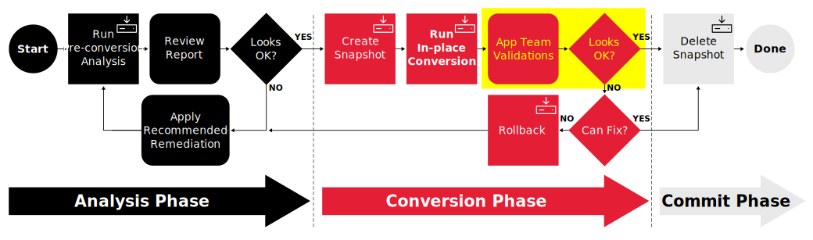
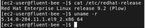

# Workshop Exercise - Check if the Conversions Were Successful

## Table of Contents

- [Workshop Exercise - Check if the Conversions Were Successful](#workshop-exercise---check-if-the-conversions-were-successful)
  - [Table of Contents](#table-of-contents)
  - [Objectives](#objectives)
  - [Guide](#guide)
    - [Step 1 - Review the Conversion Playbook Job Log](#step-1---review-the-conversion-playbook-job-log)
    - [Step 2 - Verify the Hosts are Converted to Next RHEL Version](#step-2---verify-the-hosts-are-converted-to-next-rhel-version)
  - [Conclusion](#conclusion)

## Objectives

* Review the conversion playbook job log
* Verify our pet application servers are running the newer RHEL version

## Guide

In the previous exercises, we reviewed pre-conversion analyis reports, as well as reviewing the potential for incorporating remediations. After all of that, you finally launched the Ansible playbook jobs to run the CentOS in-place conversions on your servers.

It's time to verify the results of the conversions and let our application teams assess if their pet apps are still good. We are here in our CentOS in-place conversion automation workflow:

Let's get started!

### Step 1 - Review the Conversion Playbook Job Log

The first thing we want to do is see if the job running the upgrade playbooks has finished successfully.

- Return to the AAP Web UI tab in your web browser. Navigate to Views > Jobs and then open the "OS / Upgrade" playbook run entry to see the log output from the conversions.

  > **Note**
  >
  > You will also see an entry for the "AUTO / 02 Upgrade" workflow job. Workflow jobs launch a number of playbook runs. To see the playbook log output, we need to open the playbook run entry, not the workflow job entry.

  For example:

  

- If the playbook run finished without any failed tasks, you should see "Successful" displayed with a green checkmark.

  > **Note**
  >
  > If you see "Running" with spinning arrows, the playbook is still running. Wait for the playbook run to finish before moving on with this exercise.

  Scroll down to the end of the log output to see the "PLAY RECAP" indicating the success or failure status for the playbook run executed on each host. Here is what you should expect to see:

  

  If there are no failed runs, the CentOS in-place conversion is complete on all of our application servers.

### Step 2 - Verify the Hosts are Upgraded to Next RHEL Version

Now let's make sure our pet app servers are actually converted to the next RHEL version.

- In [Exercise 1.3: Step 2](../1.3-report/README.md#step-2---navigating-the-rhel-web-console), you used the RHEL Web Console to check the installed CentOS versions on your application servers. Let's repeat those steps to see the RHEL versions reported after our conversions.

  Return to your RHEL Web Console browser tab and use the remote host menu to navigate to the web consoles of each of your application servers. The RHEL Web Console system overview page should now show the converted versions.

  > **Note**
  >
  > You may need to refresh the browser using Ctrl-R to see the newly reported RHEL version.

  For example, this pet app server that previously had CentOS 7 is now reporting RHEL 7:

  

  Here is an example one that was previously RHEL7 now running RHEL8:

  

- You can also check the RHEL and kernel versions from the command line following the steps you used with [Exercise 1.1: Step 2](../1.1-setup/README.md#step-2---open-a-terminal-session).

  At the shell prompt of your pet app servers, use the `cat /etc/redhat-release` and `uname -r` commands. Here's an example showing an application server that was converted to RHEL 7:

  

## Conclusion

In this exercise, we observed that the conversion playbook runs completed successfully. We then used the RHEL Web Console and the command line to verify the new RHEL versions were installed.

Continue to the following exercise to verify the pet application is still functioning as expected after the CentOS conversions:

- [Exercise 2.4 - How is the Three Tier App Doing?](../2.4-check-three-tier-app/README.md)

Otherwise, you may skip ahead to the next section of the workshop where we will demonstrate rolling back the CentOS conversion, starting with these exercises:

- [Exercise 3.1 - (Optional) Trash the Instance](../3.1-rm-rf/README.md)
- [Exercise 3.2 - Run Rollback Job](../3.2-rollback/README.md)

---

**Navigation**

[Previous Exercise](../2.1-upgrade/README.md) - [Next Exercise](../2.4-check-three-tier-app/README.md)

[Home](../README.md)
